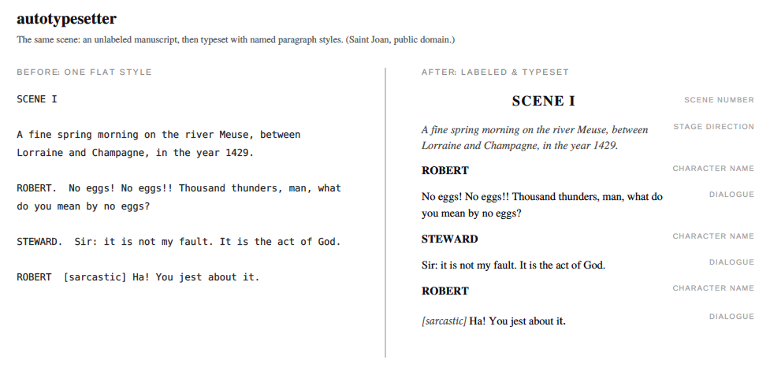

# autotypesetter

Automatically classifies the paragraphs of unlabeled plays and screenplays of
easy-to-medium messiness, or remaps already-classified ones to a custom spec,
and outputs files typeset and ready for InDesign placement, or a correctly
typeset Word document.

Input is a script in whatever shape it arrived; output is a `.docx` where
every paragraph carries a named style (character name, dialogue, stage
direction, song lyric, scene number, and so on). It is ready to be placed in InDesign
with **Show Import Options → Use InDesign Style Definition** and it picks up
house styles automatically without tagging paragraph by paragraph.



## What it takes in

| Input | What it is |
|-------|------------|
| `.fdx` | Final Draft, structure is already declared, so labeling is exact |
| `.rtf` | A Final Draft RTF export |
| `.docx` | Word, including an author's file with no real styles declared |
| `.html` | A local HTML file **or** a web URL |

Final Draft files already say what each line is, so the tool just renames the
labels to a spec. Word and HTML files usually don't, as everything is one plain
style, so it reads the manuscript and works out the structure itself.

## What it watches for

To label an unstructured script, it figures out how *that* author writes and
looks for these cues:

**Character names**
- on their own line, in CAPS
- centered
- followed by a colon — `ANNA:`
- joined to the line with an em-dash — `Anna—`
- followed by a period — `ROBERT.`
- a name then a bracketed direction — `ANNA [coldly] ...`
- group cues — `ANNA AND MARCO`, `ANNA & MARCO`

**Stage directions**
- wrapped in parentheses or brackets
- set in italics
- set at their own indent level
- stagecraft keywords — `BLACKOUT`, `CURTAIN`, `LIGHTS UP`, `INTERMISSION`,
  `THE END`, `END OF ACT`
- a direction peeled off the front of a speech — `ANNA—[rising] Listen.`

**Dialogue**
- the run of speech after a cue
- told apart from directions by indentation depth
- a short all-caps echo right after a cue (kept as dialogue, not a new cue)

**Scenes**
- `ACT` / `SCENE` / `PROLOGUE` / `EPILOGUE` headings (caps or title case, Roman
  or Arabic numerals)
- a heading carrying its setting on the same line — `Scene I.—A small room.`

**Musicals**
- song lyrics, by their indent and casing (indent set with a left indent, a
  first-line indent, or tabs — all read the same)
- song titles — numbered and bold
- a singing cue vs. a lyric line at the same indent (using the recurring cast)

**Front matter**
- title page, cast list, production notes, copyright before the first scene
  (trimmed automatically when short; flagged for `--start-at-body` when it's a
  long preface)

**Layout and cleanup**
- a cue and its dialogue bundled onto one line by a soft break
- simultaneous / overlapping dialogue laid out in tab-separated columns
- page numbers and other ebook/scan artifacts (dropped)

## How accurate is it?

- **Final Draft** — essentially 100%; the file already declares each line, so this is a simple remapping of styles
- **Tidy modern Word/HTML** — about **95–99%** of paragraphs right on the first
  pass; the few unsure lines are listed for a quick review.
- **Messy or unusual sources** — more hand-checking. Run `--report` first to see
  what it detected before you commit.

## Basic use

```
python3 autotypesetter.py manuscript.docx
python3 autotypesetter.py script.fdx
python3 autotypesetter.py play.html
python3 autotypesetter.py manuscript.docx -o final.docx
```

## Options

- `--report` -- don't convert; print a plain summary of what the script looks
  like, what got labeled, and which lines to check (with the real text).
- `--start-at-body` -- drop the title page, cast list, and notes; begin at the
  first scene.
- `--config styles.json` / `--map "Lyrics=***Song Lyrics"` -- point the labels at
  your own InDesign style names.
- `--template house.docx` -- output a fully designed Word document built on one of
  your existing files instead of an InDesign-ready one.
- `--raw-only` (HTML) -- save a plain, unstyled "as an author typed it" copy of
  the page, for collecting test manuscripts.

## Requirements

Python 3 and `python-docx` (`pip install python-docx`). HTML input needs nothing
beyond the standard library.
